# OCI AI Data Platform

## 🎯 **Objetivos**

Descobrir como utilizar de forma prática o serviço OCI AI Data Platform, criando um pipeline de ponta a ponta, importando e trabalhando com arquivos CSV, realizando transformações, criando a estrutura medalhão, criando agents e disponibilizando os resultados finais em um Autonomous Database. 

O que você aprenderá:

- Preparar a infraestrutura do OCI AI Data Platform.
- Criar catálogo, volume, workspace e cluster Spark.
- Carregar um dataset CSV para o AIDP.
- Realizar verificações de qualidade e análise exploratória dos dados.
- Criar as camadas da arquitetura medalhão com PySpark.
- Replicar datasets já processados para o Autonomous Database.
- Orquestrar notebooks sequencialmente por meio de Workflow.
- Criar e configurar agents

### _**Aproveite sua experiência na Oracle Cloud!**_

## 📌 Introdução

> **O laboratório implementa um pipeline de dados em camadas. O processamento é realizado no OCI AI Data Platform com notebooks e Spark. Neste workshop, trabalharemos um dataset CSV, processaremos os dados usando o AIDP e, por fim, disponibilizaremos os dados em um Autonomous Database na OCI e criaremos um agent simples.** 

# **Parte 1 - Hands On AI Data Platform**

## **1️⃣ Preparação da infraestrutura**

Antes de iniciar o Hands On, prepare os recursos necessários:

1.  Crie **uma instância AI Data Platform**.
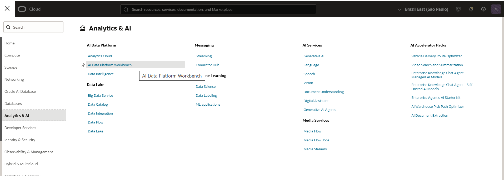

Dê um nome à sua instância e ao seu workspace e escolha as políticas padrão. Não há necessidade de preencher a seção que contém o Autonomous AI Lakehouse.

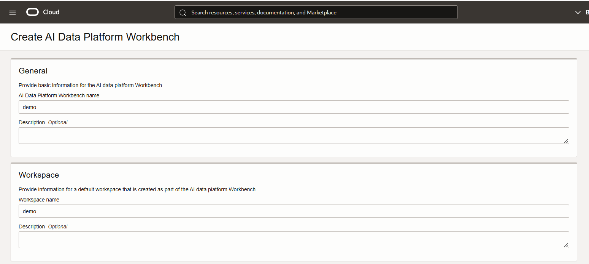

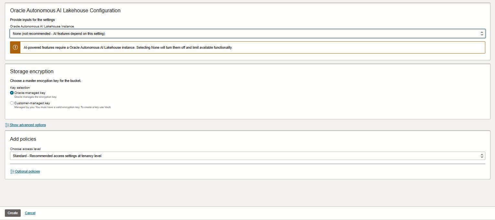

> **⚠️ ATENÇÃO:** A criação da sua instância AIDP deve demorar cerca de uns 10 minutos para conclusão.

2.  Crie **um Autonomous Database**


Crie um Autonomous Database utilizando as seguintes configurações.


> **⚠️ ATENÇÃO:** Garanta que a versão do Autonomous Database seja 26ai.


> **⚠️ ATENÇÃO:** A sugestão é utilizar a senha **WORKSHOPsec2019##**; contudo, você pode escolher outra senha, se desejar. O restante das configurações pode permanecer no padrão; em seguida, clique em **Create**.

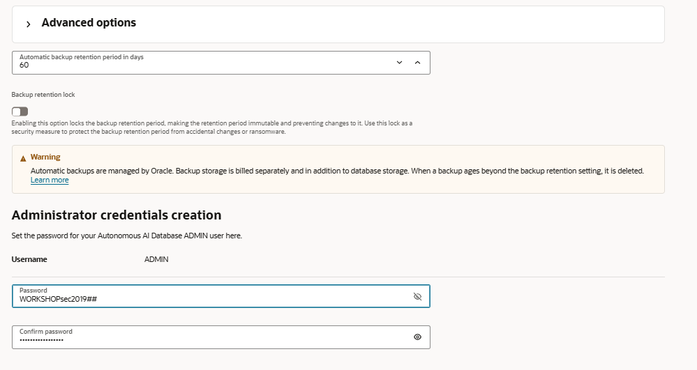

> **⚠️ ATENÇÃO:** A criação da sua instância do Autonomous Database deve demorar cerca de 5 minutos para ser concluída.

3.  Retorne à instância do AIDP e crie **um catálogo Standard**.


Clique em **Master Catalog**, depois em **Create Catalog**, dê o nome **demo** ao seu catálogo e clique em **Create**.

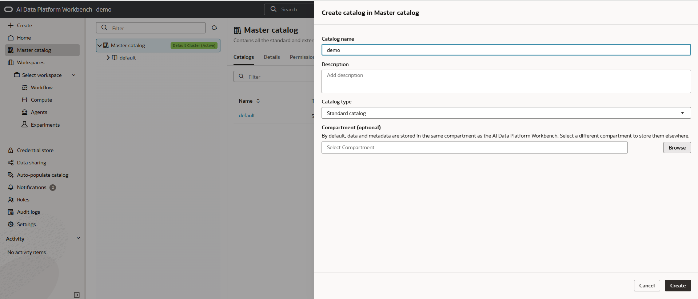

4.  Clique no catálogo demo, no schema default, escolha volumes e crie **um volume virtual Standard** clicando no botão de + (próximo ao campo de filtragem). Dê o nome de vol01

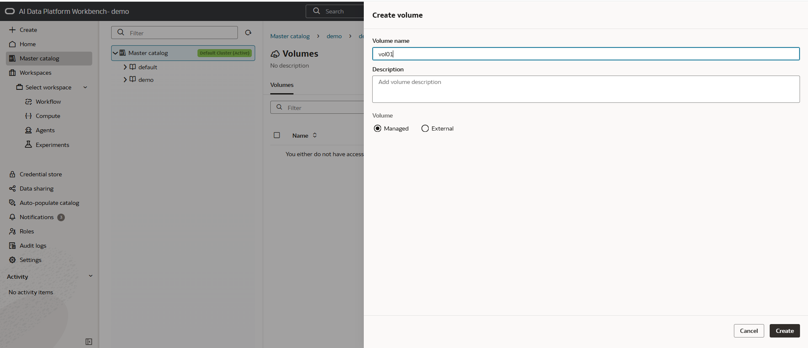

5.  Agora clique na aba do canto esquerdo em workspace, e crie **um Workspace** clicando no botão de + (próximo ao campo de filtragem). Dê o nome de workspace01.


6.  Após concluida a criação do workspace, clique no mesmo, e na aba do canto esquerdo selecione compute. Crie **um cluster Spark**, clicando no botão de + (próximo ao campo de filtragem). Dê o nome de spark01.

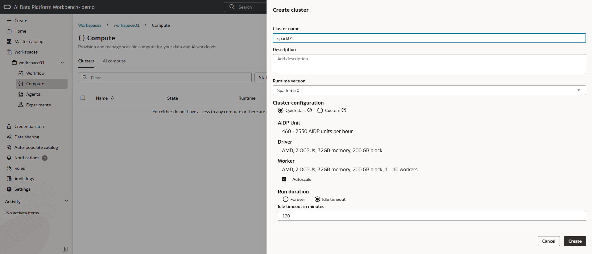

7.  Faça a integração do Autonomous Database com o AIDP, através da aba Master Catalog

Clique em create catalog, escolha o tipo external.

Na tela de detalhes do seu Autonomous Database, clique em **Database Connection** e faça o download de sua wallet


> **⚠️ ATENÇÃO:** A sugestão é utilizar a senha **WORKSHOPsec2019##**, contudo você pode escolher um outra senha se assim desejar.

Dê o nome de **adb01** ao catálogo, faça o upload da wallet no formulário do AIDP, escolha o serviço **Medium** e preencha as demais informações conforme o print abaixo.


8.  Inicie o Hands On.

## **2️⃣ Criação da camada Bronze**

No canto esquerdo da tela, clique em workspace01, e crie um novo notebook clicando no botão de + (próximo ao campo de filtragem). O primeiro passo será fazer o download dos arquivos `orders.csv` e `customers.csv`, carregá-los com Spark e persistir os dados como tabelas Delta na camada Bronze.


Renomeie o seu notebook para **notebook_bronze** (clique no **lápis**, altere o nome e pressione **Enter**) e cole o código abaixo na célula. Após colar o código, pressione **Ctrl + S** para salvá-lo.


``` python
import os
import urllib.request

orders_url = "https://raw.githubusercontent.com/caiogusto2/workshop-dataplatform/main/aidataplatform/arquivos_csv/orders.csv"
customers_url = "https://raw.githubusercontent.com/caiogusto2/workshop-dataplatform/main/aidataplatform/arquivos_csv/customers.csv"
politica_trocas_url = "https://raw.githubusercontent.com/caiogusto2/workshop-dataplatform/main/aidataplatform/arquivos_rag/politica_trocas.pdf"

# Substitua pelo caminho do volume criado no catálogo
tmp_dir = "/Volumes/demo/default/vol01"
os.makedirs(tmp_dir, exist_ok=True)

orders_file = os.path.join(tmp_dir, "orders.csv")
customers_file = os.path.join(tmp_dir, "customers.csv")
politica_trocas_file = os.path.join(tmp_dir, "politica_trocas.pdf")

urllib.request.urlretrieve(orders_url, orders_file)
urllib.request.urlretrieve(customers_url, customers_file)
urllib.request.urlretrieve(politica_trocas_url, politica_trocas_file)

df_orders = (
    spark.read
    .option("header", "true")
    .option("inferSchema", "true")
    .option("sep", ";")
    .csv(orders_file)
)

df_customers = (
    spark.read
    .option("header", "true")
    .option("inferSchema", "true")
    .option("sep", ";")
    .csv(customers_file)
)

spark.sql("CREATE CATALOG IF NOT EXISTS demo")
spark.sql("CREATE SCHEMA IF NOT EXISTS demo.bronze")

(
    df_orders.write
    .mode("overwrite")
    .option("overwriteSchema", "true")
    .saveAsTable("demo.bronze.orders")
)

(
    df_customers.write
    .mode("overwrite")
    .option("overwriteSchema", "true")
    .saveAsTable("demo.bronze.customers")
)

print("Created Delta tables:")
print("demo.bronze.orders")
print("demo.bronze.customers")
```

Para rodar o seu notebook, anexe um cluster spark e clique em run all

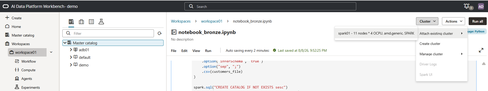

Caso tenha sucesso, o seguinte log será apresentado na tela.


### **➡️ Análise exploratória da camada Bronze**

Após o carregamento, clique no botão **+ Add a new cell** (logo abaixo do parágrafo existente no notebook) para adicionar uma nova célula e executar verificações de estrutura, amostras, valores nulos, estatísticas e duplicidades.

Copie e cole o código abaixo em uma nova célula do notebook e pressione **Ctrl + Enter** para executar apenas essa célula.

``` python
print("=== DESCRIBE TABLE: demo.bronze.orders ===")
spark.sql("DESCRIBE TABLE demo.bronze.orders").show(200, truncate=False)

print("=== DESCRIBE TABLE: demo.bronze.customers ===")
spark.sql("DESCRIBE TABLE demo.bronze.customers").show(200, truncate=False)

spark.sql("SELECT * FROM demo.bronze.orders LIMIT 10").show(10, truncate=False)
spark.sql("SELECT * FROM demo.bronze.customers LIMIT 10").show(10, truncate=False)

spark.sql("""
SELECT
  COUNT(*) AS row_count,
  SUM(CASE WHEN CUSTOMER_ID IS NULL THEN 1 ELSE 0 END) AS customer_id_nulls,
  SUM(CASE WHEN ORDER_ID IS NULL THEN 1 ELSE 0 END) AS order_id_nulls,
  SUM(CASE WHEN ORDER_DATE IS NULL THEN 1 ELSE 0 END) AS order_date_nulls,
  SUM(CASE WHEN ORDER_TOTAL IS NULL THEN 1 ELSE 0 END) AS order_total_nulls,
  SUM(CASE WHEN COST_OF_DELIVERY IS NULL THEN 1 ELSE 0 END) AS cost_of_delivery_nulls,
  MIN(ORDER_TOTAL) AS min_order_total,
  MAX(ORDER_TOTAL) AS max_order_total,
  AVG(ORDER_TOTAL) AS avg_order_total,
  MIN(COST_OF_DELIVERY) AS min_cost_of_delivery,
  MAX(COST_OF_DELIVERY) AS max_cost_of_delivery,
  AVG(COST_OF_DELIVERY) AS avg_cost_of_delivery
FROM demo.bronze.orders
""").show(truncate=False)

spark.sql("""
SELECT
  COUNT(*) AS row_count,
  SUM(CASE WHEN CUSTOMER_ID IS NULL THEN 1 ELSE 0 END) AS customer_id_nulls,
  SUM(CASE WHEN CUST_FIRST_NAME IS NULL THEN 1 ELSE 0 END) AS cust_first_name_nulls,
  SUM(CASE WHEN CUST_LAST_NAME IS NULL THEN 1 ELSE 0 END) AS cust_last_name_nulls,
  SUM(CASE WHEN CUST_EMAIL IS NULL THEN 1 ELSE 0 END) AS cust_email_nulls,
  SUM(CASE WHEN CREDIT_LIMIT IS NULL THEN 1 ELSE 0 END) AS credit_limit_nulls,
  MIN(CREDIT_LIMIT) AS min_credit_limit,
  MAX(CREDIT_LIMIT) AS max_credit_limit,
  AVG(CREDIT_LIMIT) AS avg_credit_limit
FROM demo.bronze.customers
""").show(truncate=False)

spark.sql("""
SELECT CUSTOMER_ID, ORDER_ID, COUNT(*) AS cnt
FROM demo.bronze.orders
GROUP BY CUSTOMER_ID, ORDER_ID
HAVING COUNT(*) > 1
ORDER BY cnt DESC
""").show(truncate=False)

spark.sql("""
SELECT CUSTOMER_ID, COUNT(*) AS cnt
FROM demo.bronze.customers
GROUP BY CUSTOMER_ID
HAVING COUNT(*) > 1
ORDER BY cnt DESC
""").show(truncate=False)
```

Caso a execução tenha sucesso, os seguintes resultados aparecerão com a análise dos dados recém-importados.


## **3️⃣ Criação da camada Silver**

Seguindo os mesmos passos da etapa anterior, crie um novo notebook para a camada Silver. Dê o nome de **notebook_silver**. Nesta etapa, as tabelas `orders` e `customers` da Bronze são combinadas pelo campo `CUSTOMER_ID`.

``` python
from pyspark.sql.functions import col

df_orders = spark.table("demo.bronze.orders")
df_customers = spark.table("demo.bronze.customers")

spark.sql("CREATE SCHEMA IF NOT EXISTS demo.silver")

df_join = (
    df_orders.alias("o")
    .join(df_customers.alias("c"), on="CUSTOMER_ID", how="inner")
)

df_silver = df_join.select(
    col("CUSTOMER_ID"), col("ORDER_ID"), col("ORDER_DATE"),
    col("ORDER_MODE"), col("ORDER_STATUS"), col("ORDER_TOTAL"),
    col("SALES_REP_ID"), col("PROMOTION_ID"), col("WAREHOUSE_ID"),
    col("DELIVERY_TYPE"), col("COST_OF_DELIVERY"),
    col("WAIT_TILL_ALL_AVAILABLE"), col("DELIVERY_ADDRESS_ID"),
    col("o.CUSTOMER_CLASS").alias("ORDER_CUSTOMER_CLASS"),
    col("CARD_ID"), col("INVOICE_ADDRESS_ID"), col("CUST_FIRST_NAME"),
    col("CUST_LAST_NAME"), col("NLS_LANGUAGE"), col("NLS_TERRITORY"),
    col("CREDIT_LIMIT"), col("CUST_EMAIL"), col("ACCOUNT_MGR_ID"),
    col("CUSTOMER_SINCE"), col("c.CUSTOMER_CLASS").alias("CUSTOMER_CLASS"),
    col("SUGGESTIONS"), col("DOB"), col("MAILSHOT"),
    col("PARTNER_MAILSHOT"), col("PREFERRED_ADDRESS"), col("PREFERRED_CARD")
)

df_silver.printSchema()
df_silver.show(10, truncate=False)

(
    df_silver.write
    .mode("overwrite")
    .option("overwriteSchema", "true")
    .saveAsTable("demo.silver.customers_orders")
)
```
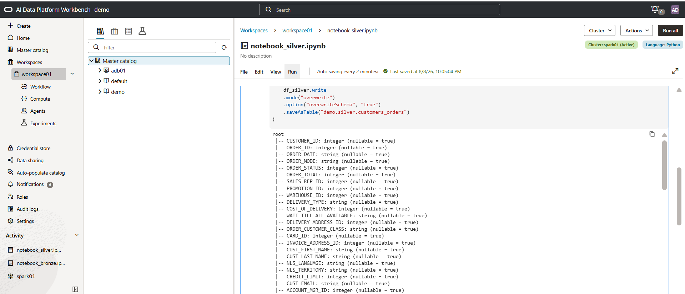

### **➡️ Análise exploratória da Silver**

Conforme o notebook anterior, crie uma nova célula ainda dentro do **notebook_silver** e cole o conteúdo abaixo:
``` python
import pyspark.sql.functions as F

df_analyze = spark.table("demo.silver.customers_orders")

print(f"Rows: {df_analyze.count()}")
print(f"Columns: {len(df_analyze.columns)}")

df_analyze.select([
    F.count(F.when(F.col(c).isNull(), c)).alias(c)
    for c in df_analyze.columns
]).show(truncate=False)

(
    df_analyze.groupBy("ORDER_ID")
    .count()
    .filter(F.col("count") > 1)
    .show(truncate=False)
)

(
    df_analyze
    .agg(F.countDistinct("CUSTOMER_ID").alias("distinct_customers"))
    .show()
)

df_analyze.describe().show(truncate=False)
```
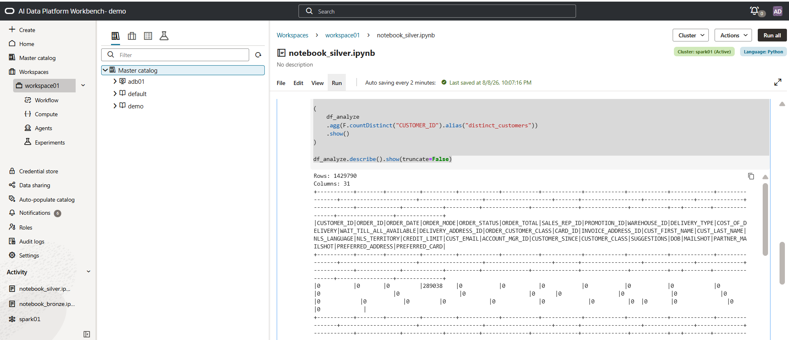

## **4️⃣ Criação da camada Gold**

Seguindo os mesmos passos da etapa anterior, crie um novo notebook chamado **notebook_gold**. A camada Gold normaliza `CUSTOMER_CLASS` e agrega os pedidos para produzir indicadores de quantidade, vendas e ticket médio.

``` python
import pyspark.sql.functions as F

spark.sql("CREATE SCHEMA IF NOT EXISTS demo.gold")

df_silver = spark.table("demo.silver.customers_orders")

df_norm = (
    df_silver
    .withColumn(
        "CUSTOMER_CLASS_NORM",
        F.trim(
            F.regexp_replace(
                F.regexp_replace(F.upper(F.col("CUSTOMER_CLASS")), u"\u00A0", " "),
                r"\s+",
                " "
            )
        )
    )
)

df_gold = (
    df_norm
    .groupBy("CUSTOMER_CLASS_NORM")
    .agg(
        F.count("ORDER_ID").alias("total_orders"),
        F.round(F.sum("ORDER_TOTAL"), 2).alias("total_sales"),
        F.round(F.avg("ORDER_TOTAL"), 2).alias("avg_order_value")
    )
    .orderBy(F.col("total_orders").desc())
)

df_gold.show(truncate=False)

(
    df_gold.write
    .mode("overwrite")
    .option("overwriteSchema", "true")
    .saveAsTable("demo.gold.customer_class_agg_review")
)

spark.table("demo.gold.customer_class_agg_review").show(truncate=False)
```


## **5️⃣ Escrita no Autonomous Database**

Por fim, vamos replicar e escrever as tabelas `demo.silver.customers_orders` e `demo.gold.customer_class_agg_review` no Autonomous Database mapeado anteriormente. Outros exemplos podem ser encontrados na página https://github.com/oracle-samples/oracle-aidp-samples/tree/main.

Crie um novo notebook e dê o nome de **notebook_adb**; copie e cole o código abaixo.

Execute o notebook e os dados serão replicados para o Autonomous Database previamente configurado com o AIDP.

``` python
# ------------------------------------------------------------
# Silver
# ------------------------------------------------------------

silver_df = spark.table("demo.silver.customers_orders")

silver_df.show(10, truncate=False)

silver_df.write.saveAsTable("adb01.ADMIN.CUSTOMERS_ORDERS")

print("Silver carregada com sucesso!")


# ------------------------------------------------------------
# Gold
# ------------------------------------------------------------

gold_df = spark.table("demo.gold.customer_class_agg_review")

gold_df.show(truncate=False)

gold_df.write.saveAsTable("adb01.ADMIN.CUSTOMER_CLASS_AGG_REVIEW")

print("Gold carregada com sucesso!")
```


Apenas para teste, crie uma nova célula e faça uma consulta nas tabelas recém-carregadas no Autonomous Database. Copie e cole o código abaixo:

``` python
alh_df_silver = spark.read.format("aidataplatform") \
    .option("catalog.id", "adb01") \
    .option("pushdown.sql", "SELECT * FROM ADMIN.CUSTOMERS_ORDERS WHERE CUSTOMER_ID = 11") \
    .load()

alh_df_silver.show()

alh_df_gold = spark.read.format("aidataplatform") \
    .option("catalog.id", "adb01") \
    .option("pushdown.sql", "SELECT * FROM ADMIN.CUSTOMER_CLASS_AGG_REVIEW WHERE CUSTOMER_CLASS_NORM = 'PRIME'") \
    .load()

alh_df_gold.show()
```
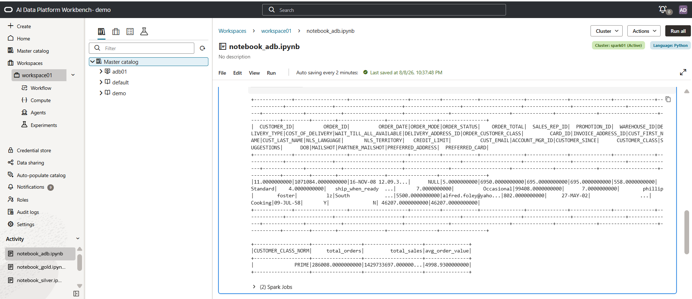

## **6️⃣ Orquestração com Workflow**

Por fim, clique no canto esquerdo em **Workflow > Create Job**, dê o nome de **job01** e configure as quatro atividades em sequência, associando cada uma aos notebooks criados para as camadas:

``` text
notebook_bronze  ->  notebook_silver  ->  notebook_gold  ->  notebook_adb
```


Execute o workflow, acompanhe a execução e valide os resultados de cada atividade na aba run.


Caso haja interesse em agendar a execução do workflow, isso pode ser feito na aba de configuração do job, clicando em **Details** e **Schedule**. O job também pode ser acionado por meio de APIs e SDKs.

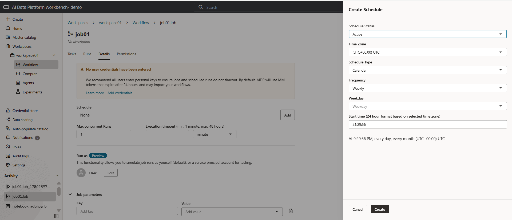

## **7️⃣ Criação de Agents**

Uma vez que tenhamos os datasets populados dentro do AIDP conseguimos criar facilmente agents. Nosso agent terá o objetivo de responder perguntas sobre os clientes da base processada e nossa politica de devolução de produtos.

Primeiramente vamos criar a nossa knowledge base. No canto esquerdo clique em Master Catalog e no catalogo demo

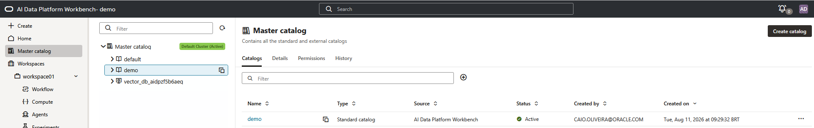

Na sequencia clique em default, knowledge bases, no botão de + proximo ao buscador e faça a criação da knowledge bases


Dentro da knowledge base pdf01, clique no botão de + (proximo ao filtro) e adicione o vol01 como a imagem abaixo


Feita a etapa do knowledge base, vamos seguir com a criação do agent. Clique no canto esquerdo (dentro do seu workspace) em agents e depois no botão de + próximo ao campo de filtro

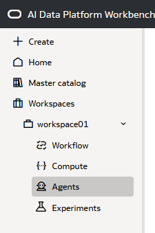

Dê o nome de agent01 e clique em criar


Arraste o componente Chat trigger e executor agent para dentro da tela. Alem disso arraste também as tools de sql e rag para dentro da tela; Monte as conexões entre os componentes e deixe-os da segunite forma


Clique no agent (icone verde) e configure da seguinte forma


Clique em sql_1 (icone marrom) e configure da seguinte forma


``` sql
select CUST_EMAIL, CUST_FIRST_NAME, CUSTOMER_ID, ORDER_MODE, ORDER_ID, DELIVERY_TYPE from demo.silver.customers_orders WHERE CUSTOMER_ID = {{id}}
```

Clique em rag_1 (icone roxo) e configure da seguinte forma

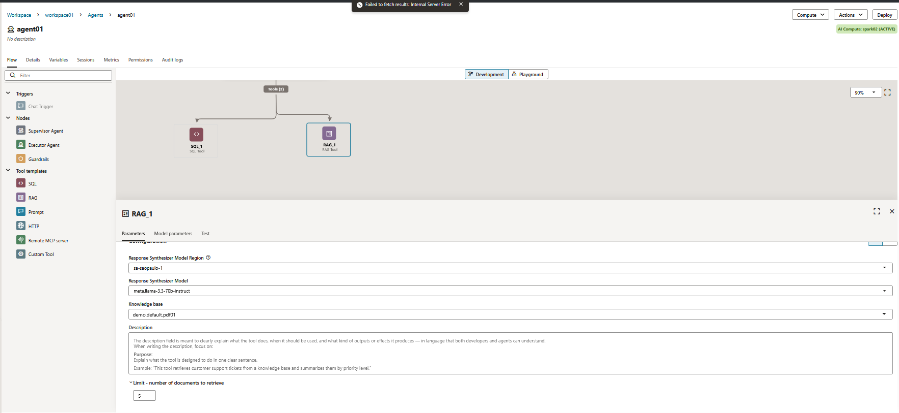

Finalizado o setup, clique no icone playground na parte superior da tela


No canto superior direito, clique em Create a new AI Compute e depois Attach to AI Compute


No canto inferior esquerdo digite as perguntas de teste do nosso agent:
- quais são as formas de reembolso para meu pedido?
- qual o email para o usuario com id 749998?

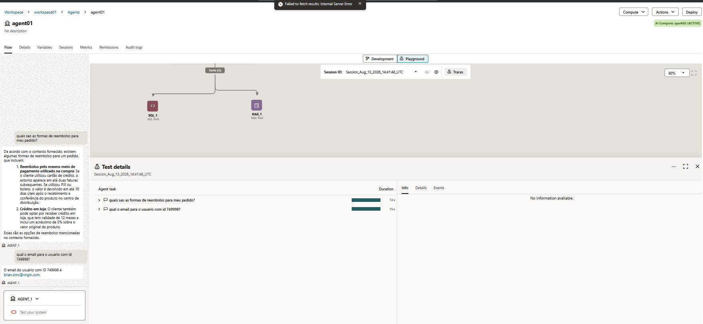

Agora clique no canto superior direito em deploy


Uma vez terminado o deploy clique em details e teremos as URLs de integação


Em sessions conseguimos ver as sessões ativas e uso de tokens


E clicando em métricas conseguimos ter um overview do ambiente como um todo

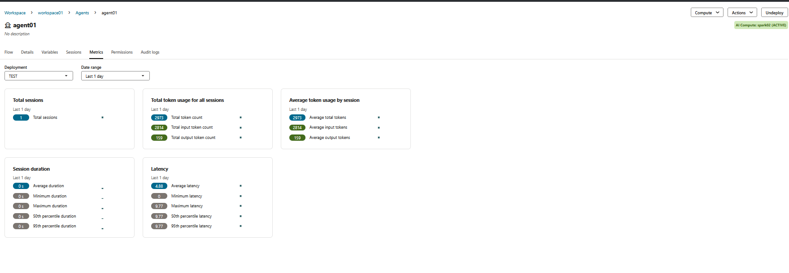

------------------------------------------------------------------------

## **✅ Laboratório finalizado!**

Parabéns! Você concluiu o hands-on do **OCI AI Data Platform (AIDP)**, construindo as camadas **Bronze**, **Silver** e **Gold**, orquestrando as atividades por meio de um **Workflow** e criando um agent simples sobre os dados processados.


## 👥 Agradecimentos

- **Autores** - Caio Oliveira
- **Autores Contribuintes** - Isabelle Anjos
- **Última atualização** - Agosto de 2026

## 🛡️ Declaração de Porto Seguro (Safe Harbor)

O tutorial apresentado tem como objetivo traçar a orientação dos nossos produtos em geral. É destinado somente a fins informativos e não pode ser incorporado a um contrato. Ele não representa um compromisso de entrega de qualquer tipo de material, código ou funcionalidade e não deve ser considerado em decisões de compra. O desenvolvimento, a liberação, a data de disponibilidade e a precificação de quaisquer funcionalidades ou recursos descritos para produtos da Oracle estão sujeitos a mudanças e são de critério exclusivo da Oracle Corporation.

Esta é a tradução de uma apresentação em inglês preparada para a sede da Oracle nos Estados Unidos. A tradução é realizada como cortesia e não está isenta de erros. Os recursos e funcionalidades podem não estar disponíveis em todos os países e idiomas. Caso tenha dúvidas, entre em contato com o representante de vendas da Oracle. 
