# Oracle 26ai Autonomous Database

## 🎯 **Objetivos**

Demonstrar, de forma prática, como utilizar algumas das funcionalidades do Oracle Autonomous Database para atender a workloads de Data Warehouse.

O que você aprenderá:

- Criar e configurar novos schemas e usuários no Oracle Autonomous Database.
- Realizar e orquestrar transformações utilizando procedures e Oracle Scheduler.
- Importar e configurar uma aplicação Select AI.
- Configurar e testar Data Redaction.
- Configurar o ORDS para consultas sobre datasets.

>### ⚠️ **ATENÇÃO**: Recomendamos que, antes de iniciar este workshop, você conclua o hands-on de AI Data Platform.

### _**Aproveite sua experiência na Oracle Cloud!**_

## 📌 Introdução

>**Este hands-on apresenta, de forma prática, como o Oracle Autonomous Database 26ai pode complementar a AI Data Platform, oferecendo recursos para atender workloads de Data Warehouse de maneira integrada, segura e automatizada. Ao longo do workshop, você aprenderá a criar e configurar schemas e usuários, realizar e orquestrar transformações de dados com procedures e Oracle Scheduler, importar e configurar aplicações com Select AI, implementar Data Redaction para proteção de informações sensíveis e configurar o ORDS para disponibilizar consultas sobre datasets. A proposta é proporcionar uma experiência prática com funcionalidades essenciais do Autonomous Database dentro da Oracle Cloud.** 

# **Parte 2 - Hands On Oracle Autonomous Database**

## **1️⃣ Criação de schema e preparação do ambiente**

Utilize a instância do Oracle Autonomous Database criada no hands-on do OCI AI Data Platform.


Clique em **Database Users**.


Clique em **+ Criar usuário**, crie o usuário `AI` e conceda os grants conforme a captura de tela abaixo.

> **⚠️ ATENÇÃO:** A sugestão é utilizar a senha **WORKSHOPsec2019##**, contudo, você pode escolher outra senha se assim desejar. Para as demais configurações, você pode utilizar os valores padrão e clicar no botão **Create**.


## **2️⃣ Configurar e orquestrar transformações utilizando procedures e Oracle Scheduler**

No menu do canto superior esquerdo, clique em **SQL**.

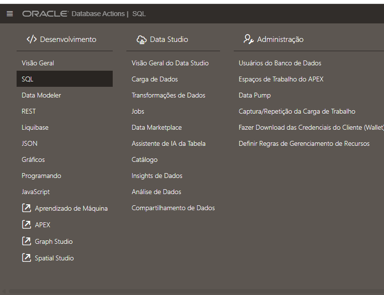

Caso tenha concluído com sucesso o laboratório do AI Data Platform, você deverá visualizar os dois datasets replicados: `CUSTOMERS_ORDERS` e `CUSTOMER_CLASS_AGG_REVIEW`.

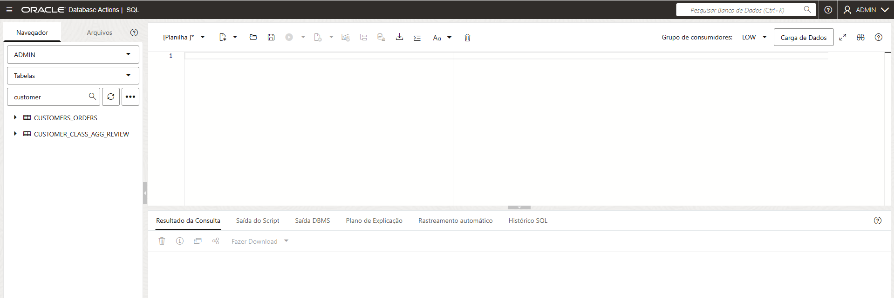

Clique e arraste o dataset `CUSTOMERS_ORDERS` para o centro da tela, selecione a caixa **Selecionar** e clique em **Aplicar**.

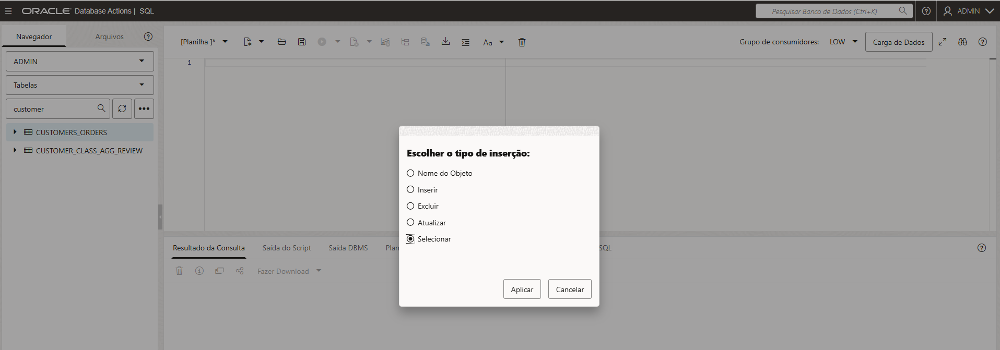

Altere o grupo de consumidores para **medium**.


Clique no centro da tela e pressione **Ctrl + Enter** para executar a query.


Clique com o botão direito no dataset e escolha **Abrir**.


Navegue pelos dados, consulte os metadados do objeto e clique em **Fechar**.

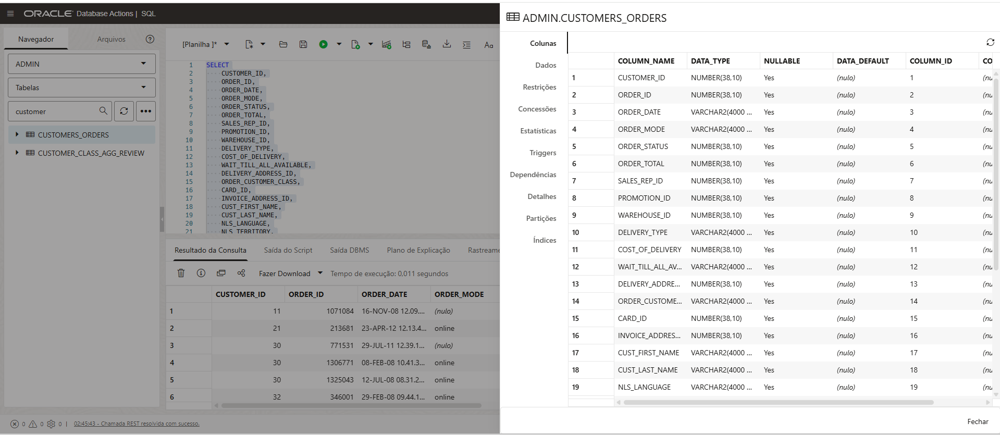

De volta ao worksheet, conceda alguns grants adicionais ao usuário `AI`. Copie, cole e execute o bloco abaixo pressionando **F5**.

``` sql
GRANT dwrole TO ai;
GRANT unlimited tablespace TO ai;
GRANT READ, WRITE ON DIRECTORY data_pump_dir TO ai;
GRANT EXECUTE ON DBMS_CLOUD TO ai;
GRANT CREATE PROPERTY GRAPH TO ai;
GRANT EXECUTE ON DBMS_LOCK TO ai;
GRANT EXECUTE ON DBMS_CLOUD_AI TO ai;
GRANT EXECUTE ON SYS.DBMS_REDACT TO AI;
GRANT ADMINISTER REDACTION POLICY TO AI;

BEGIN
  DBMS_NETWORK_ACL_ADMIN.APPEND_HOST_ACE(
    host => '*',
    ace => xs$ace_type(privilege_list => xs$name_list('connect'),
                       principal_name => 'ai',
                       principal_type => xs_acl.ptype_db));
END;
/ 
```

Agora, crie e teste a procedure de replicação de datasets. O objetivo é replicar as tabelas `CUSTOMERS_ORDERS` e `CUSTOMER_CLASS_AGG_REVIEW` do schema `ADMIN` para o schema `AI`.

Crie e teste a procedure de replicação de datasets

``` sql
CREATE OR REPLACE PROCEDURE ADMIN.REFRESH_AI_TABLES
AS
BEGIN
    -- Drop AI.CUSTOMER_ORDERS if it exists
    BEGIN
        EXECUTE IMMEDIATE 'DROP TABLE AI.CUSTOMERS_ORDERS PURGE';
    EXCEPTION
        WHEN OTHERS THEN
            IF SQLCODE != -942 THEN
                RAISE;
            END IF;
    END;

    -- Recreate AI.CUSTOMER_ORDERS
    EXECUTE IMMEDIATE '
        CREATE TABLE AI.CUSTOMERS_ORDERS AS
        SELECT *
        FROM ADMIN.CUSTOMERS_ORDERS
    ';

    -- Drop AI.CUSTOMER_CLASS_AGG_REVIEW if it exists
    BEGIN
        EXECUTE IMMEDIATE 'DROP TABLE AI.CUSTOMER_CLASS_AGG_REVIEW PURGE';
    EXCEPTION
        WHEN OTHERS THEN
            IF SQLCODE != -942 THEN
                RAISE;
            END IF;
    END;

    -- Recreate AI.CUSTOMER_CLASS_AGG_REVIEW
    EXECUTE IMMEDIATE '
        CREATE TABLE AI.CUSTOMER_CLASS_AGG_REVIEW AS
        SELECT *
        FROM ADMIN.CUSTOMER_CLASS_AGG_REVIEW
    ';

END REFRESH_AI_TABLES;
/
```

``` sql
BEGIN
    ADMIN.REFRESH_AI_TABLES;
END;
/
```
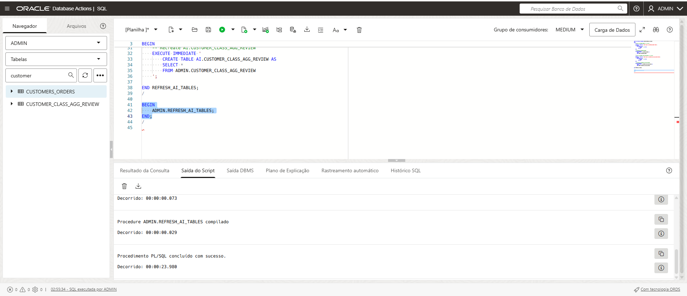

Agora, clique no ícone do canto superior esquerdo e selecione **Programação**.


Clique em + Criar job, dê o nome de AI_Refresh, selecione a classe sys.medium e cole o bloco abaixo

``` sql
BEGIN
    ADMIN.REFRESH_AI_TABLES;
END;
```


Na aba **Modo de execução**, configure a procedure para ser executada de hora em hora e clique em **Criar**.

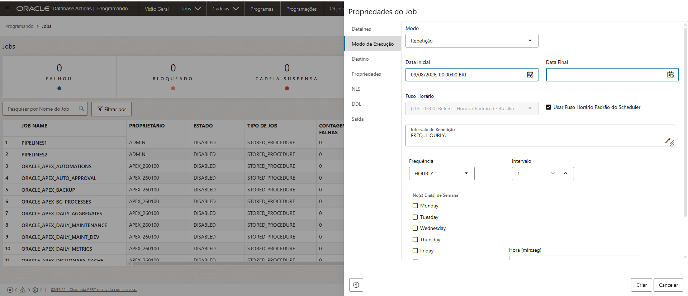

Execute o seu job


Após a conclusão, clique na aba de histórico e relatório para obter uma visão completa das execuções e de possíveis erros.

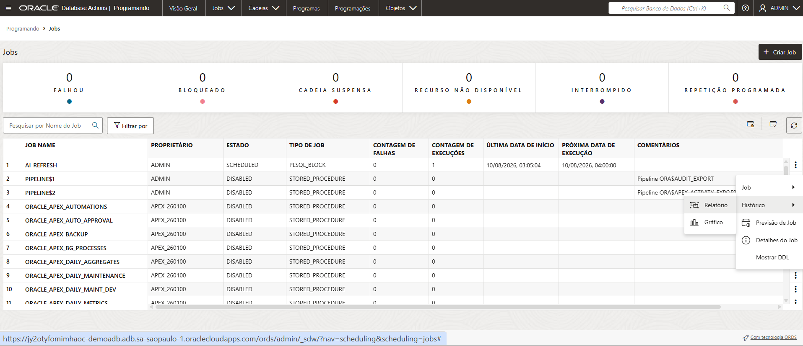

## **3️⃣ Importar e configurar aplicação Select AI**

Clique no ícone do canto superior esquerdo e selecione apex, faça o login novamente com o usuário ADMIN e a senha configurada na criação do Autonomous Database


Clique no ícone create workspace no canto direito da tela e selecione existing schema

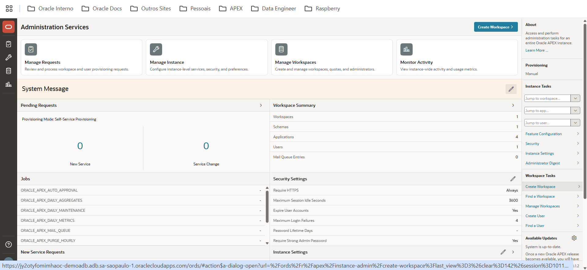

Selecione o schema AI e coloque a senha do ambiente, recomendamos a senha conforme o print screen; Clique em create workspace

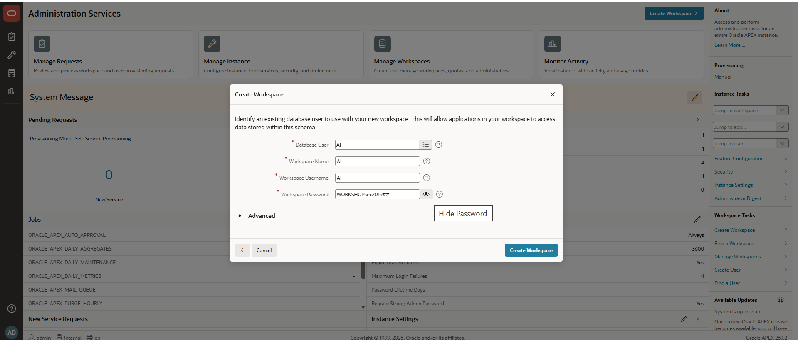

Na parte inferior esquerda da tela, faça o logoff do ambiente

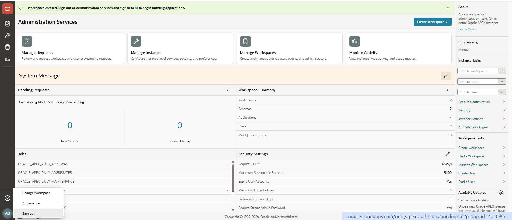

Na tela do login, faça o login com o usuário AI e senha configurada na etapa anterior.

Na sequência clique em SQL Workshop e SQL Commands

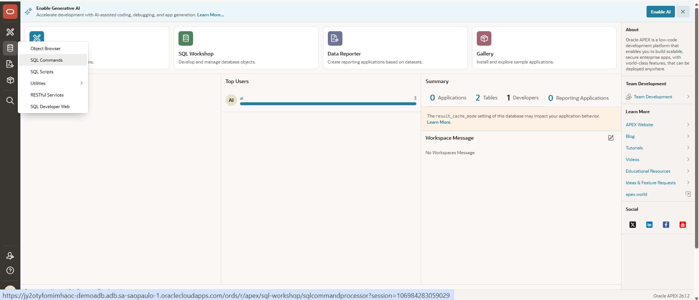

Copie e cole o código abaixo (observação: vamos ter que fazer algumas alterações na sessão de create_credential conforme os ids e configurações do seu ambiente)

``` sql
BEGIN
   DBMS_CLOUD.CREATE_CREDENTIAL (
       credential_name => 'OBJ_STORE_CRED',
       user_ocid       => '<USER_OCID>',
       tenancy_ocid    => '<TENANCY_OCID>',
       private_key     => '<PRIVATE_KEY_SEM_CABEÇALHO_RODAPÉ>',
       fingerprint     => '<FINGERPRINT_CHAVE>');
END;
/

begin
   dbms_cloud_ai.create_profile(
    profile_name => 'OCI_GENAI',
    attributes   => '{"provider": "oci",
        "model":"meta.llama-3.3-70b-instruct" ,
        "credential_name": "OBJ_STORE_CRED",
        "object_list": [
            {"owner": "AI"}
            ],
        "region": "sa-saopaulo-1",
        "comments":"true"
    }'
   );
end;
/   
```

As informações referentes ao dbms_cloud.create_credential podem ser coletadas a aba de configurações do seu usuário OCI

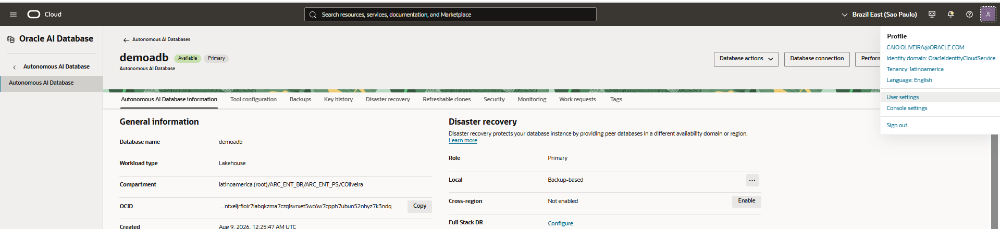

Na aba de token and keys, crie uma API Key, faça o download da chave privada e clique no canto direito em view configuration file

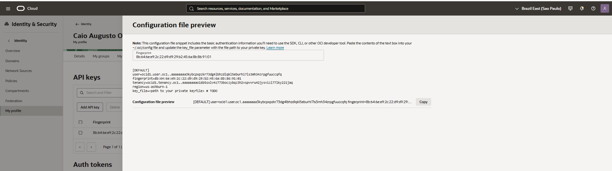

Abaixo o exemplo de preenchimento do código que deve ser executado dentro do apex

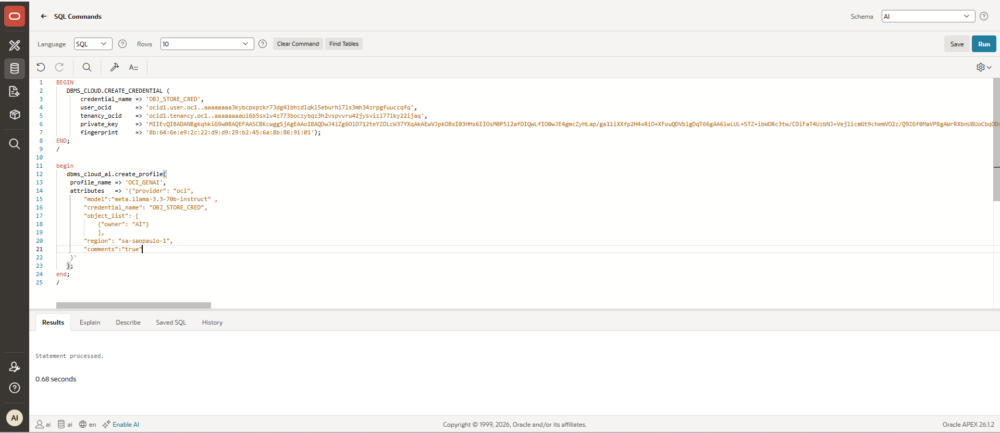

Agora vamos adicionar comentários à tabela CUSTOMERS_ORDERS para facilitar o uso do Select AI. No apex clique em sql scripts


Clique em create e cole o código abaixo. Dê o nome de comentarios_tabela e após isso, clique em run

``` sql
COMMENT ON TABLE AI.CUSTOMERS_ORDERS IS
'Tabela de pedidos e perfil de clientes usada para análises, segmentação e geração de consultas em linguagem natural no Select AI.';

COMMENT ON COLUMN AI.CUSTOMERS_ORDERS.CUSTOMER_ID IS
'Identificador único do cliente.';

COMMENT ON COLUMN AI.CUSTOMERS_ORDERS.ORDER_ID IS
'Identificador único do pedido.';

COMMENT ON COLUMN AI.CUSTOMERS_ORDERS.ORDER_DATE IS
'Data do pedido armazenada como texto.';

COMMENT ON COLUMN AI.CUSTOMERS_ORDERS.ORDER_MODE IS
'Canal ou modo de realização do pedido, como online, loja ou outro canal.';

COMMENT ON COLUMN AI.CUSTOMERS_ORDERS.ORDER_STATUS IS
'Status numérico do pedido.';

COMMENT ON COLUMN AI.CUSTOMERS_ORDERS.ORDER_TOTAL IS
'Valor total do pedido.';

COMMENT ON COLUMN AI.CUSTOMERS_ORDERS.SALES_REP_ID IS
'Identificador do representante de vendas responsável pelo pedido.';

COMMENT ON COLUMN AI.CUSTOMERS_ORDERS.PROMOTION_ID IS
'Identificador da promoção aplicada ao pedido.';

COMMENT ON COLUMN AI.CUSTOMERS_ORDERS.WAREHOUSE_ID IS
'Identificador do armazém ou centro de distribuição responsável pelo pedido.';

COMMENT ON COLUMN AI.CUSTOMERS_ORDERS.DELIVERY_TYPE IS
'Tipo de entrega selecionado para o pedido.';

COMMENT ON COLUMN AI.CUSTOMERS_ORDERS.COST_OF_DELIVERY IS
'Custo de entrega do pedido.';

COMMENT ON COLUMN AI.CUSTOMERS_ORDERS.WAIT_TILL_ALL_AVAILABLE IS
'Indica se o pedido aguarda todos os itens ficarem disponíveis antes do envio.';

COMMENT ON COLUMN AI.CUSTOMERS_ORDERS.DELIVERY_ADDRESS_ID IS
'Identificador do endereço de entrega.';

COMMENT ON COLUMN AI.CUSTOMERS_ORDERS.ORDER_CUSTOMER_CLASS IS
'Classe ou segmento do cliente no contexto do pedido.';

COMMENT ON COLUMN AI.CUSTOMERS_ORDERS.CARD_ID IS
'Identificador do cartão utilizado no pedido.';

COMMENT ON COLUMN AI.CUSTOMERS_ORDERS.INVOICE_ADDRESS_ID IS
'Identificador do endereço de cobrança ou faturamento.';

COMMENT ON COLUMN AI.CUSTOMERS_ORDERS.CUST_FIRST_NAME IS
'Primeiro nome do cliente.';

COMMENT ON COLUMN AI.CUSTOMERS_ORDERS.CUST_LAST_NAME IS
'Sobrenome do cliente.';

COMMENT ON COLUMN AI.CUSTOMERS_ORDERS.NLS_LANGUAGE IS
'Idioma preferencial do cliente.';

COMMENT ON COLUMN AI.CUSTOMERS_ORDERS.NLS_TERRITORY IS
'Território ou região preferencial do cliente.';

COMMENT ON COLUMN AI.CUSTOMERS_ORDERS.CREDIT_LIMIT IS
'Limite de crédito do cliente.';

COMMENT ON COLUMN AI.CUSTOMERS_ORDERS.CUST_EMAIL IS
'Endereço de e-mail do cliente.';

COMMENT ON COLUMN AI.CUSTOMERS_ORDERS.ACCOUNT_MGR_ID IS
'Identificador do gerente de conta responsável pelo cliente.';

COMMENT ON COLUMN AI.CUSTOMERS_ORDERS.CUSTOMER_SINCE IS
'Data desde quando o cliente está cadastrado, armazenada como texto.';

COMMENT ON COLUMN AI.CUSTOMERS_ORDERS.CUSTOMER_CLASS IS
'Classe ou segmento principal do cliente.';

COMMENT ON COLUMN AI.CUSTOMERS_ORDERS.SUGGESTIONS IS
'Sugestões ou recomendações associadas ao cliente.';

COMMENT ON COLUMN AI.CUSTOMERS_ORDERS.DOB IS
'Data de nascimento do cliente armazenada como texto.';

COMMENT ON COLUMN AI.CUSTOMERS_ORDERS.MAILSHOT IS
'Indica se o cliente aceita receber campanhas de marketing por e-mail.';

COMMENT ON COLUMN AI.CUSTOMERS_ORDERS.PARTNER_MAILSHOT IS
'Indica se o cliente aceita receber campanhas de parceiros.';

COMMENT ON COLUMN AI.CUSTOMERS_ORDERS.PREFERRED_ADDRESS IS
'Identificador do endereço preferido do cliente.';

COMMENT ON COLUMN AI.CUSTOMERS_ORDERS.PREFERRED_CARD IS
'Identificador do cartão preferido do cliente.';  
```

Concluído o setup, vamos clicar em App builder e import


Faça o download do arquivo https://raw.githubusercontent.com/caiogusto2/workshop-dataplatform/main/autonomousdb/app_apex/selectai.zip e upload para o formulário; Clique next, depois import application, next, install supporting objects e por fim run application

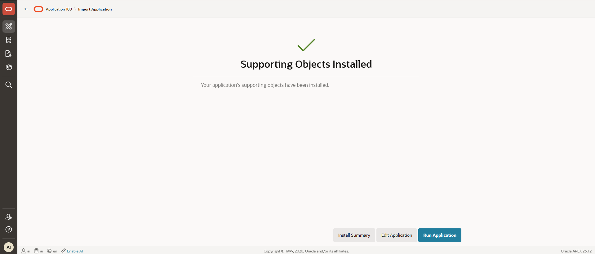

O login será AI e a senha WORKSHOPsec2019##

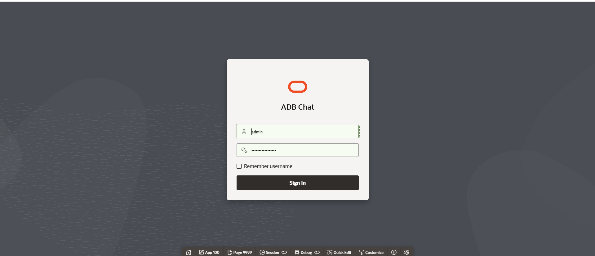

Selecione `OCI_GENAI` e clique no x

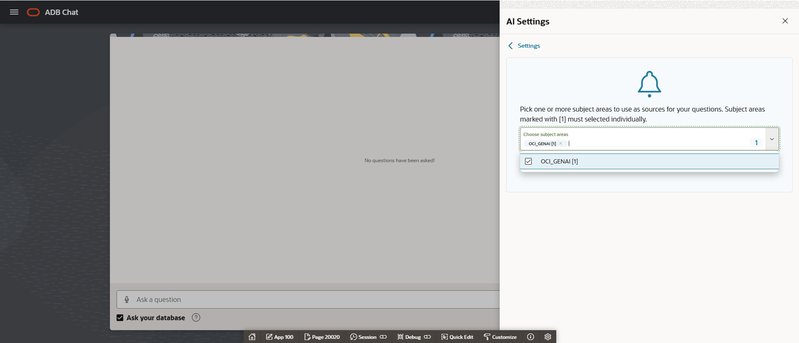

Pergunte: Qual a quantidade de ordens por delivery_type


Outras perguntas que podem ser feitas
- qual a quantidade de ordens por customer_class
- quais as ordens efetuadas pelo email alfred.foley@yahoo.com
- qual a quantidade de ordens por warehouse_id

## **4️⃣ Configurar e testar ORDS**

De volta ao apex, vamos primeiramente configurar o data redaction para a coluna de email da nossa tabela CUSTOMERS_ORDERS. Clique em SQL Commands

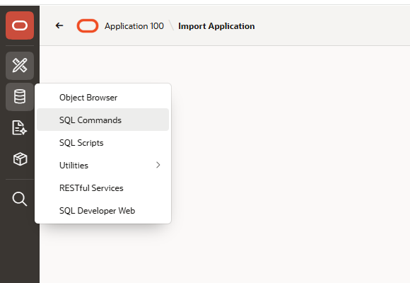

Copie e cole o comando abaixo

``` sql
BEGIN
  DBMS_REDACT.ADD_POLICY(
    object_schema  => 'AI',
    object_name    => 'CUSTOMERS_ORDERS',
    policy_name    => 'REDACT_CUST_EMAIL_ORDS',
    column_name    => 'CUST_EMAIL',
    function_type  => DBMS_REDACT.FULL,
    expression     => 'SYS_CONTEXT(''USERENV'',''MODULE'') = ''/v1/consulta'''
  );
END;
/
```

Faça um teste e veja que como estamos logado com o usuário AI temos acesso completo ao dataset

``` sql
select cust_first_name, cust_last_name, cust_email from customers_orders;
```


Agora clique na aba de RESTful Services


Clique em Modules > create module, dê o nome de api e base path v1

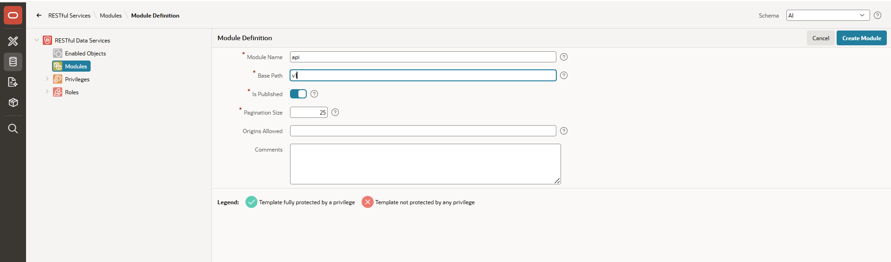

Na sequência clique em create template e na uri template escreva consulta

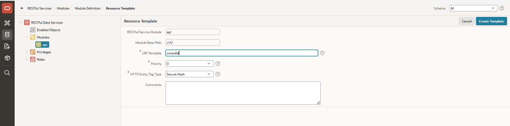

Na sequência, crie um handler e no source coloque 

``` sql
select cust_first_name, cust_last_name, cust_email from customers_orders
```

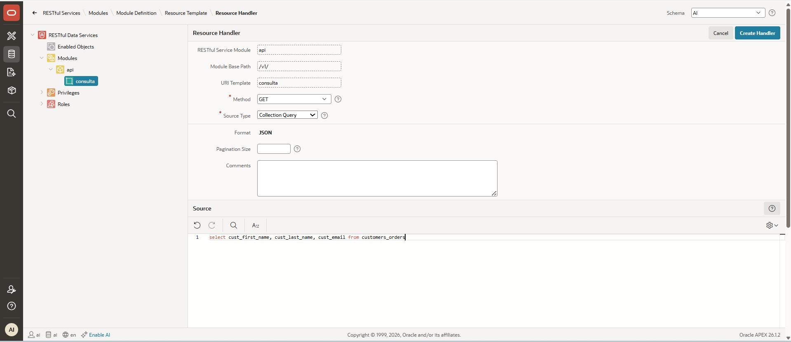

Copie e cole a URL no navegador web, seus dados aparecerão, contudo o e-mail estará nulo por conta da regra de redaction


## **✅ Laboratório finalizado!**

Parabéns! Você concluiu o Hands On do **Oracle Autonomous**, aprendeu a utilizar as tabelas carregadas pelo AI Data Platform para orquestrar e realizar outras diferentes transformações usando procedures e scheduler, importou e configurou uma aplicação apex que demonstra o uso do Select AI e por fim criou um endpoint REST com uma regra de redaction.


## 👥 Agradecimentos

- **Autores** - Caio Oliveira
- **Autores Contribuintes** - Isabelle Anjos
- **Última Atualização Por/Data** - Agosto 2026

## 🛡️ Declaração de Porto Seguro (Safe Harbor)

O tutorial apresentado tem como objetivo traçar a orientação dos nossos produtos em geral. É destinado somente a fins informativos e não pode ser incorporado a um contrato. Ele não representa um compromisso de entrega de qualquer tipo de material, código ou funcionalidade e não deve ser considerado em decisões de compra. O desenvolvimento, a liberação, a data de disponibilidade e a precificação de quaisquer funcionalidades ou recursos descritos para produtos da Oracle estão sujeitos a mudanças e são de critério exclusivo da Oracle Corporation.

Esta é a tradução de uma apresentação em inglês preparada para a sede da Oracle nos Estados Unidos. A tradução é realizada como cortesia e não está isenta de erros. Os recursos e funcionalidades podem não estar disponíveis em todos os países e idiomas. Caso tenha dúvidas, entre em contato com o representante de vendas da Oracle. 
